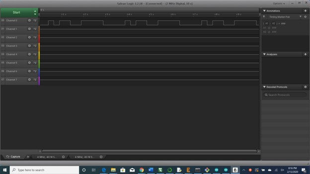
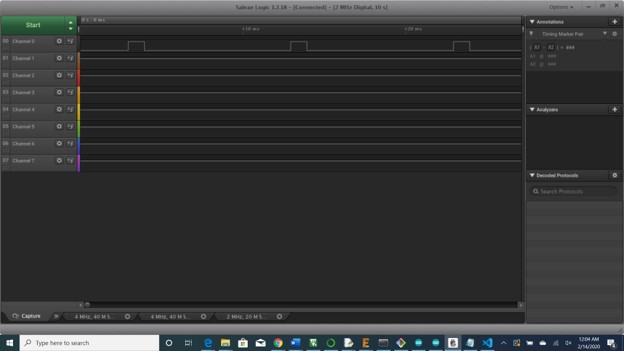
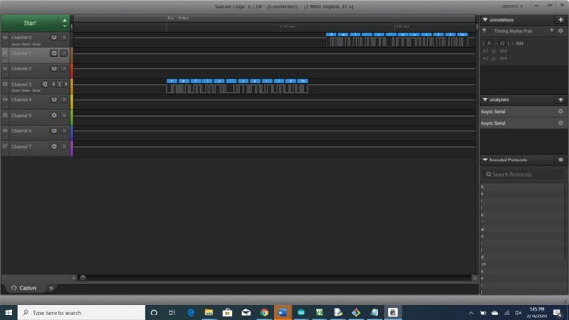
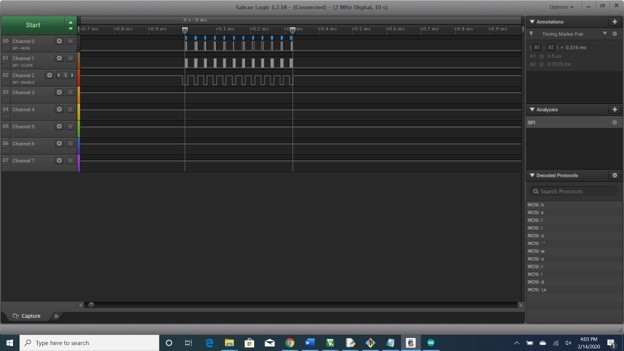

Name: Ameil Kumar

EID: Ask2373

Team Number: 8

## Questions

1. Why does your program need a setup and a loop?

    Our program needs a setup and a loop in order to do all of the initializations once and then the loop is used to execute something continuously/on repeat. For the blink lab, for example, the setup was used to set the pin modes while the loop was used to change the output of the loop per user-inputted requests(i.e. delay, dimming, etc).

2. What is the downside to putting all your code in a loop?

    Putting all the code in the loop means that it is ran every single time and takes up more time than necessary. Often times, we only need to have the program do something once so putting it outide the loop would be very beneficial. 

3. Why does your code need to be compiled?

    The code needs to be compiled to ensure that there are no errors in the first pass for which the program would not be able to run properly. 

4. When lowering the frequency in procedure A, step 4, what is going wrong? Brainstorm some solutions. Dimmers exist in the real world. What is their solution?

    When we lower the frequency, the human eyes can start to see the light turning on and off instead of it looking like it's dimming. The real world solution is to always keep the frequency high enough such that it is not visible from human eyes.

5. Why do you need to connect the logic analyzer ground to the ESP32 ground?

    It needs to be connected to ground because otherwise, the circuit could be incomplete as what is supposed to be ground would be float, which is not necessarily equivalent to ground. 

6. What is the difference between synchronous and asynchronous communication?

    synchronized communications use synchronized clocks while asynchronous communications use flow control to transmit data. Asynchronous is also usually slower than synchronous. 

7. Profile of UART: Sent X bytes in Y time 

    Sent 12 bytes in 12.56 ms.

8. Profile of SPI: Sent X bytes in Y time

    Sent 12 bytes in .36 ms.

9. Why is SPI so much faster than UART?

    SPI is faster because it is a synchronous protocol while UART is asynchronous.

10. list one pro and one con of UART

    UART is very simple to set up physically but is quite slow. 

11. list one pro and one con of SPI

    SPI is very fast but requires a more complex wiring. 

12. list one pro and one con of I2C

    I2C is multi-master but is half-duplex only. 

13. Why does I2C need external resistors to work?

    External resistors are needed to act as pull-up resistors between the power source and GND. Otherwise, current flow wouldn't be correct. 
## Screenshots

Procedure A, step 1:

Procedure A, step 4:

Procedure B, UART:

Procedure B, SPI:

